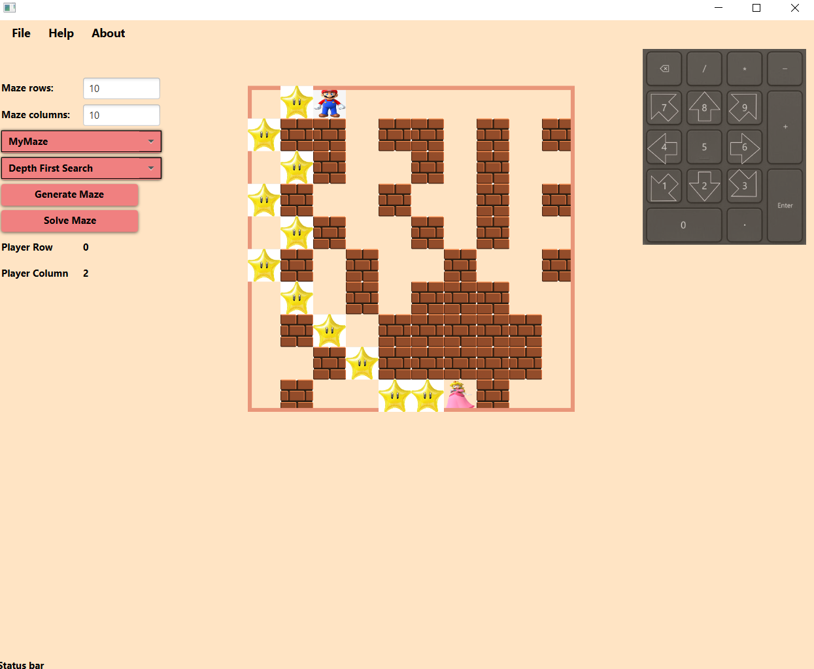

Super Mario Maze Generation and Solver Project

Overview
This project is a Java-based application that generates, displays, compresses, and solves mazes, styled with Super Mario aesthetics. The design features a colorful, retro-inspired GUI, engaging animations, and interactive functionality.

Features
Maze Generation: Supports multiple algorithms for creating complex mazes.
Maze Solving: Implements search algorithms to find optimal paths.
Compression and Decompression: Efficiently compress and decompress mazes for storage.
Graphical User Interface (GUI): An interactive Super Mario-themed display for maze generation and solving.
Custom Styling: Incorporates Super Mario icons, and elements for a fun and nostalgic experience.

Project Structure
The project is organized into the following components:

Maze Generators
AMazeGenerator.java: Abstract class that defines the structure for maze generation.
EmptyMazeGenerator.java: Creates an empty maze layout.
MyMazeGenerator.java: Custom maze generation algorithm inspired by Mario levels.
SimpleMazeGenerator.java: Basic maze generation for quick demos.
Maze Representation
Maze.java: Defines the maze structure and associated functions.
Position.java: Represents individual positions in the maze.

Search Algorithms
DepthFirstSearch.java: Depth-first search for solving mazes.
BestFirstSearch.java: Optimized best-first search algorithm.
ISearchable.java: Interface for making mazes searchable.
ISearchingAlgorithm.java: Interface for search algorithms.
SearchableMaze.java: Adapts a maze for search compatibility.
MazeState.java: Represents a single state in the maze search process.

Compression
SimpleCompressorOutputStream.java: Uses run-length encoding for maze compression.
SimpleDecompressorInputStream.java: Decompresses maze data to its original form.

Server and Client Communication
Server.java / Client.java: Manages interactions between the server and client.
IServerStrategy.java / IClientStrategy.java: Interfaces for communication strategies.
ServerStrategyGenerateMaze.java: Server-side maze generation.
ServerStrategySolveSearchProblem.java: Server-side maze-solving logic.

GUI Components
MazeDisplayer.java: Custom component that renders the maze visually.
MyViewController.java / MyView.fxml / MainStyle.css: Defines the graphical user interface, styled to look like classic Super Mario.
CSS Styling: Icons from the Super-Mario game for a playful appearance.

Utility and Configuration
Configurations.java: Manages configurations across the application.

Demo and Execution
RunMazeGenerator.java / RunSearchOnMaze.java: Example classes to test maze generation and solving.
RunCompressDecompressMaze.java: Shows compression and decompression in action.
RunCommunicateWithServers.java: Demonstrates server-client communication.
Main.java: Application entry point.

Resources
Images: Mario, wall,solution (the starts from the game), solvedMaze (princess peach) to enhance the Mario experience.
Audio: Super Mario theme music for background ambiance.
Video: A demo video file (GIF.mp4) showing maze generation and solving with Mario-themed graphics.
